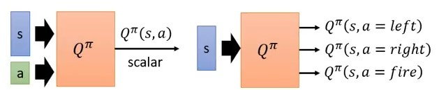
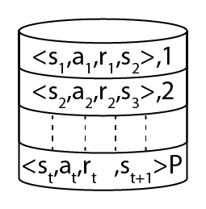
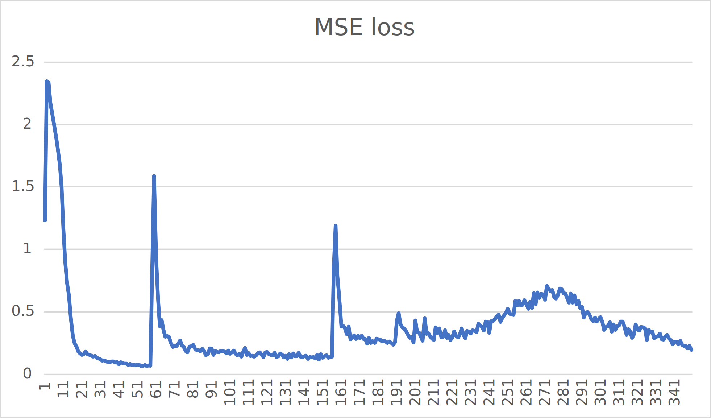
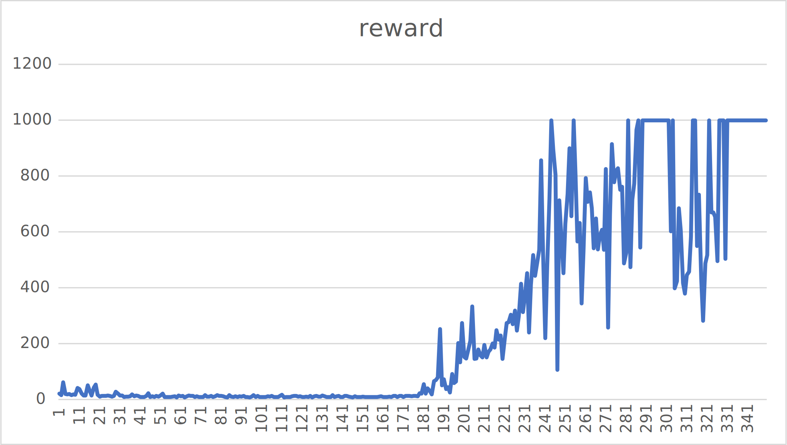
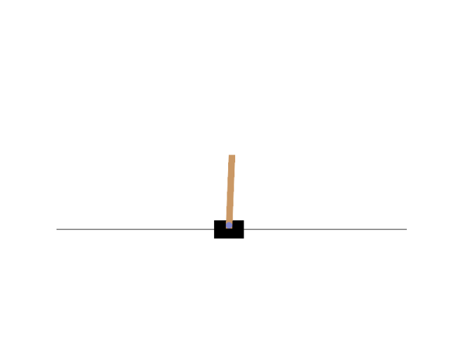

# Deep Q-Learning Network (DQN)

作者: CHUN-CHENG LIN
日期: 2024/08/05

---

## Value based vs Policy based

之前提到的policy gradient以及其延伸算法是屬於policy based，而DQN是屬於value based的訓練方式。

+ Policy based: NN看到一個state $s$ 後輸出每個action的機率值，利用每一個action的機率$p(a), a \in A$，利用這些$p(a)$做機率分布distribution sample出下一個採取的動作。
+ Value based: NN看到一個state $s$ 後輸出的是一路玩到結束的期望累計分數。

## Critic ($V^\pi$)

### 說明—State value function

Critic不是像actor一樣直接決定下一個action的機率，Critic是評估actor的policy $\pi$ 的好壞，定義上寫作$V^\pi(s)$，其意義是採取policy $\pi$ 的條件下，看到state $s$ 後一路累積到結束的期望累計分數。

> 小複習: policy $\pi$ 的定義是 $\pi: S \to A$，也就是$\pi(s) = a, s \in S, a \in A$，state集合 $S$ 與action集合 $A$ 的mapping。

注意，critic並不能單獨評斷state的好壞，因為critic不能採取action，action的決策取決於actor的policy，因此critic要評估之前要綁定一個policy才能評估期望分數，所以很可能對於不同的policy而言，相同的state會評估出不同的分數。

### 如何評估$V^\pi(s)$

#### Monte-Carlo based (MC based)

Monte-Carlo based很直覺，就是讓actor去與environment互動，然後統計看到state $s_a$後分數有多大(假設累計分數為$G_a$)以及看到state $s_b$後分數有多大($G_b$)，這樣就可以算出期望累計分數，這可以實作table作映射，然而假設今天是玩遊戲，state是遊戲的畫面，基本上不可能枚舉出所有遊戲的畫面可能性，如此用table變得不切實際，因此table的方法不行，就是改用function的時候，而這個function就是NN，NN的好處是即便遇到沒遇過的state，NN還是會想辦法輸出一個值(即便是random、無意義)，NN輸出$V^\pi(s_a)、V^\pi(s_b)$，這變成regression problem，目標是讓NN的$V^\pi(s_a)、V^\pi(s_b)$與實際的$G_a、G_b$越靠近越好。

#### Temporal-difference based (TD based)

MC based有個問題，它的計算量很大，因為必須要玩完整個episode才能計算$G$，假設episode很長就沒辦法簡單的模擬。

> 複習: episode的過程可以被描述成一串序列 $s_1, a_1, r_1, s_2 ... s_t, a_t, r_t, s_{t + 1}$

利用episode的序列可以發現到一個重要的關係式:
$$V^\pi(s_t) = V^\pi(s_{t + 1}) + r_t$$這個式子帶給我們新的訓練方式:
將$s_t$輸入NN得到$V^\pi(s_t)$，輸入$s_{t+1}$得到$V^\pi(s_{t+1})$，目標是讓$V^\pi(s_t) - V^\pi(s_{t+1})$與實際的$r_t$越接近越好，利用$V^\pi(s_t) - V^\pi(s_{t+1}) \leftrightarrow r_t$的loss可以訓練NN。
TD based有可以step更新的好處，但是假設$V^\pi$估的不準，此時應用$V^\pi(s_t) = V^\pi(s_{t + 1}) + r_t$估出來的也會不準。

> MC與TD估出來的值很可能會不一樣，但不代表誰對誰錯，原因是計算方法不同。

## Another Critic ($Q^\pi$)

### 說明—State-action value function

$Q^\pi(s, a)$可以說是$V^\pi(s)$的延伸版，$Q^\pi(s, a)$的定義是當actor看到state $s$ 後**一定**採取action $a$ 且接下來都採用policy $\pi$ 一路玩到結束的期望累計分數。

### 實作與理論的差異


圖片取自 李宏毅老師 [https://youtu.be/o_g9JUMw1Oc?si=OarFwW3faXeIwHLH&t=1103](https://youtu.be/o_g9JUMw1Oc?si=OarFwW3faXeIwHLH&t=1103)
這是$Q^\pi$的實作方式，左邊是像定義一樣輸入state $s$ 以及action $a$ 然後NN輸出該state action pair的期望累計分數，但是右邊實作更加常用，右邊的方式是只輸入state $s$ ，NN輸出的是動作空間中所有action $a, a \in A$的期望累計分數，右邊的NN一次輸出所有的state action pair的期望值，這在實作時方便許多，因此更為常用，但是雖然實作方式有改變，但在數學上的表示法還是統一的。
可以注意到這樣的實作方式代表著DQN適用於離散動作空間(因為action space不能無限大)，基本上處理連續動作空間DQN沒有優勢，一般不考慮。

## Q-Learning

Q-learning是DQN的前身，所以在推導DQN之前應先了解Q-learning，Q-learning較屬於傳統機器學習的範疇，因此在原本的Q-learning中沒有NN的存在，而是列table計算。

### Q-Learning訓練方式

可能讀者會好奇，上面文章講了半天似乎都在講critic的應用，但critic又不會與environment互動，那要怎麼讓actor學會與environment交互?
這邊先劇透，其實Q-learning中並沒有實作actor(policy)，只有critic($Q^\pi$)，但是有$Q^\pi$其實就可以訓練出actor(policy)，訓練過程會像是:

只要有訓練好的$Q^\pi$就能找到更好的policy $\pi'$，$\pi'$再繼續與environment互動，用$\pi'$互動的結果訓練$Q^\pi$，不斷循環，policy就會越來越好。

#### 什麼叫做比較好的policy

上面提到我們可以不斷的找到更好的policy，但什麼叫做更好的policy?其實定義很簡單:
$$V^{\pi'}(s) \geq V^\pi(s) \text{, for all state } s$$，也就是利用policy $\pi'$ 去互動得到的分數皆大於等於用 $\pi$ 去互動得到的分數，我們就說policy $\pi'$ 比 $\pi$ 好。

#### 如何利用$Q^\pi$找到更好的policy $\pi$

想法很簡單，既然要讓$V^{\pi'}(s) \geq V^\pi(s) \text{, for all state } s$，那麼就用greedy的想法:
$$\pi'(s) = \mathop{\arg\max}\limits_{a}Q^\pi(s, a)$$，利用$Q^\pi$找下一個policy，該policy就是遇到每一個state $s$ 時都選預估可使累計分數最大的action $a$，這樣的policy不斷決策下去可使累計分數最大(假設$Q^\pi$估的準)，所以在Q-Learning中並不會實作另一個NN作為actor，而是只有一個NN能夠預測$Q^\pi$，利用這個QNN就能當作actor NN來用，也就是當看到state $s$後去採取期望能夠得到最高分的action $a$作為下個action，這樣的policy稱作**greedy policy**。

#### 證明

> 注意每一步取當前最好最後episode的R就會最好，這想法與Markov Decision Process (MDP)有關，也就是下一個state只與當前state有關。

##### 為什麼greedy policy是正確的方式

簡單證明，首先一定存在至少一個optimal policy $\pi^*$，這樣的optimal policy不一定唯一，但是他們的value function是一樣的，因為$\pi^*$一定滿足$$V^{\pi^*}(s) \geq V^\pi(s) \text{, for all } s \in S \text{ and policy } \pi$$，在此條件下，optimal policy的value function必須相等，否則就有一些optimal policy不是optimal，顯然矛盾。
注意到$V^{\pi*}(s) = \mathop{\max}\limits_{a}Q^{\pi*}(s,a)$，可以輕鬆的發現optimal policy一定是greedy policy。

##### 利用greedy policy可以找到更好的policy之存在性

 $$
\begin{align}
    &給定\pi'(s) = \mathop{\arg\max}\limits_{a}Q^\pi(s,a)\nonumber\\
    &V^\pi(s) = Q^\pi(s,\pi(s)) \leq \mathop{\max}\limits_{a}Q^\pi(s,a) = Q^\pi(s,\pi'(s))\\
    &整理得V^\pi(s) \leq Q^\pi(s,\pi'(s))\\
    &又Q^\pi(s,\pi'(s)) = \mathbb{E}[r_t+V^\pi(s_{t+1}) | s_t = s,a_t = \pi'(s)]\\
    &\leq \mathbb{E}[r_t+Q^\pi(s_{t+1},\pi'(s_{t+1})) | s_t = s,a_t = \pi'(s_t)]\\
    &=\mathbb{E}[r_{t} + r_{t+1} + V^\pi(s_{t+2})|\cdots]\\
    &\leq \mathbb{E}[r_t + r_{t+1} + Q^\pi(s_{t+2}, \pi'(s_{t+2}))|\cdots]\\
    &\vdots\nonumber\\
    &\leq V^{\pi'}(s)\\
    &因此最終V^\pi(s) \leq V^{\pi'}(s)\nonumber
\end{align}$$說明:
+ $(1)$ 將$V^\pi(s)$依照定義寫成$Q^\pi$，自然會小於等於最大的$Q^\pi$，並依照greedy policy的定義，$\mathop{\max}\limits_{a}Q^\pi(s,a) = Q^\pi(s,\pi'(s))$
+ $(2)$ 整理$(1)$得到$V^\pi(s) \leq Q^\pi(s,\pi'(s))$
+ $(3) \sim (6)$是將$Q^\pi$寫成期望值的數學表達式並一路展開到episode結束
+ $(7)$ 是因為將期望值展開到episode結束，利用上面$(3) \sim (6)$可以知道$V^\pi(s)$會小於等於$V^{\pi'}(s)$

這個證明闡述了一件重要的事:
當我們利用訓練好的$Q^\pi$這個critic，就一定存在比當前policy $\pi$ 更好的 policy $\pi'$，相同過程循環下去policy能夠變得越來越好，但是要注意這只是證明存在性，並不保證找到的policy表現遞增性，還是可能發生訓練收斂不理想的情況。

#### Discounted Reward

這裡說明一個小技巧，在實作上可說是不可或缺，當在估計當前state $s_t$ 到未來整場episode的總預估reward $R_t$時，最簡單的方法是乖乖地加起來，也就是$$R_t = r_t + r_{t+1} + r_{t+2} + \cdots + r_T = \sum_{k = 0}^{T}r_{t+k}$$然而有兩個層面需要思考:
1. 有的情況沒有明確的結束，如此$R_t = \sum_{k = 0}^{\infty}r_{t+k}$會變得無限大
2. 對於當前階段$t$，越遠的未來預估會變得越不確定，但是在計算中對於每個階段的reward給予相同的影響力，不太合理

最簡單且常用的方法是加上一個discounted常數 $\gamma, \gamma \in [0.0, 1.0]$，通常 $\gamma$ 設為靠近$1$的數字(如$\gamma=0.99\text{ or }0.95$)，數學上寫作:$$R_t = r_t + \gamma r_{t+1} + \gamma^2 r_{t+2} + \cdots + \gamma^{T - t} r_T = \sum_{k = 0}^{T} \gamma^k r_{t+k}$$

#### Bellman equation

結合之前提到的遞迴關係式$V^\pi(s) = V^\pi(s_{t+1}) + r_t$以及discounted reward，以下遞迴式稱作Bellman equation for $V^\pi$:$$V^\pi(s) = \mathbb{E}^\pi[r_t+\gamma V^\pi(s_{t+1}) | s_t = s]$$利用$V^\pi(s) = Q^\pi(s,\pi(s))$可得到Bellman equation for $Q^\pi$:$$Q^\pi(s,a)=\mathbb{E}^\pi[r_t+\gamma Q^\pi(s_{t+1},\pi(s_t+1)) | s_t = s,a_t = a]$$

#### Qtable

Q-Learning實作的方式是列table，state-action對應的表格有對應的$Q^\pi$值，Qtable類似於:
|          | $s_1$            | $s_2$            | $\cdots$ |
|----------|----------------- |------------------|---|
| $a_1$    | $Q^\pi(s_1,a_1)$ | $Q^\pi(s_2,a_1)$ | $\cdots$ |
| $a_2$    | $Q^\pi(s_1,a_2)$ | $Q^\pi(s_2,a_2)$ | $\cdots$ |
| $\vdots$ | $\cdots$         | $\cdots$         | $\cdots$ |

#### 探索(Exploration)

探索在Q-Learning的意義是在更新Qtable時，當下看到state $s$ 採取action $a$ 得到reward $r$，此時$Q^\pi(s,a)$那一格才會被更新，因此若該state-action沒有嘗試過，Qtable的對應格子便不會改變，保持一開始設定的值，然而在greedy policy中每次選擇的是$Q^\pi$值最大的action，這樣的方式很可能造成**看過的情況**太少，導致收斂在local maximum，例如貪食蛇遊戲，假如我們設定吃到蘋果加一分，假設第一局運氣好蛇向上後就吃到蘋果加一分，Qtable更新後變成蛇都只會向上了(假設Qtable值都初始成$0$，由於向上會加分，向上變成唯一正數的最高分action)，解決方式是加入隨機性，在選擇action時不總是只取預測最好的，改為一定機率直接random下一個action，很可能因為這次的隨機action反而發現分數更高的方式。
探索的設計可以很多樣，常用的一種方法是$\epsilon$-greedy:$$a_t \gets \begin{cases}\mathop{\arg\max}\limits_{a}Q^\pi(s,a), &\text{with probability 1 - }\epsilon\\\text{uniform random}, &\text{otherwise}
\end{cases}$$其中$\epsilon$可以是固定值，也可以隨著訓練次數減小。

#### Q-Learning更新循環

1. 看到state $s$ 後，依據$\epsilon$-greedy選取action $a$，environment反饋next state $s'$ 以及reward $r$
2. 更新Qtable:$$Q^\pi(s,a) \gets Q^\pi(s,a) + \alpha [r + \gamma \mathop{\max}\limits_{a'}Q^\pi(s',a') - Q^\pi(s, a)]$$
3. $s \gets s'$

這是一個循環，直到episode結束為止，其中 $\gamma$ 是discount rate，$\alpha$ 是學習率，不斷的訓練下去Qtable會收斂，policy就能越來越好。

## Q-Learning到Deep Q-Learning

### Q-Learning有什麼問題?

Q-Learning實作方式用table，然而在更多情況下state沒有辦法枚舉，如Atari遊戲、OpenAI gym的cartpole，這些遊戲的state一個是遊戲畫面一個是連續值，也就是說state space是無限大的，如此便無法利用table計算$Q^\pi(s, a)$，也就是狀態維度爆炸的問題。
table不行就用function逼近，function不好算，自然想到用NN學習收斂，讓NN去學習預測$Q^\pi$。

### DQN重要改良技巧

#### Target NN

上面的TD error有提到$Q^\pi(s_t,a_t) \leftrightarrow r_t + Q^\pi(s_{t+1}, \pi(s_{t+1}))$，其中$Q^\pi(s_t, a_t)$是QNN輸出的prediction，$r_t + Q^\pi(s_{t+1}, \pi(s_{t+1}))$是回歸預測的target，目標是希望prediction - target $=Q^\pi(s_t,a_t) - Q^\pi(s_{t+1}, \pi(s_{t+1})) \leftrightarrow r_t $越接近$r_t$越好，然而可以注意到prediction與target共用一個NN，這代表當NN在學習預測時target也一起在變動，prediction變target也跟著變，在實作上將導致收斂不穩定。
解決辦法是多一個QNN稱作$Q_{target}$，將$Q_{target}$凍結權重，如此$r_t + Q^\pi(s_{t+1}, \pi(s_{t+1}))$就會固定下來。
實作上$Q_{target}$會初始化成原本QNN $Q$的copy，之後每隔一段時間將$Q$的權重copy到$Q_{target}$。
因此DQN轉變成訓練$Q$去預測$Q_{target} + r$，最小化MSE error，即regression problem。

#### Replay Buffer


Replay buffer可說是DQN的法寶，利用replay buffer DQN變為off-policy的訓練方式，replay buffer實作上可當作環形陣列，可append資料，當超過容量上限時將最晚的資料覆蓋，每次訓練時支持sample一個batch的資料，利用batch data更新QNN的權重，這代表DQN可以回合更新，可利用歷史資料更新，甚至可以從不同的policy去學習更新，replay buffer有以下好處:
+ 資料運用效率較好，可減少與environment互動的開銷(與environment互動其實才是RL的成本來源)
+ 訓練調整參數時可增加訓練資料的多樣性

## 實作

### 程式說明

定義參數

```py
# ARG.py
gamma = 0.95

initEpsilon = 0.9
endEpsilon = 0.05
epsilonDecay = 0.99

Q_Target_Update_Freq = 1000
MemoryCapacity = 100000

lr = 0.0003

Max_Timesteps_Per_Episode = 1000
Max_Timesteps_Per_Batch = 4000

BatchSize = 128
```

定義QNN

```py
# QNN.py
import torch

class QNN(torch.nn.Module):
    def __init__(self, inDim, outDim):
        super().__init__()
        self.l1 = torch.nn.Linear(inDim, 16)
        self.relu1 = torch.nn.ReLU()
        self.l2 = torch.nn.Linear(16, 16)
        self.relu2 = torch.nn.ReLU()
        self.l3 = torch.nn.Linear(16, outDim)
    def forward(self, x):
        out = self.l1(x)
        out = self.relu1(out)
        out = self.l2(out)
        out = self.relu2(out)
        out = self.l3(out)
        return out
```

即簡單的DNN，用於解決regression的基礎選擇。

定義replay buffer

```py
# ReplayBuffer.py
import numpy as np

class RelplayBuffer:
    def __init__(self, stateDim, batchSize, bufferSize):
        self.batchSize = batchSize
        self.maxSize = bufferSize
        # ReplayBuffer的pointer，代表現在要寫入的位置
        self.ptr = 0
        self.currSize = 0
        
        self.state = np.zeros(shape = (self.maxSize, stateDim), dtype = np.float32)
        self.action = np.zeros(shape = (self.maxSize, 1), dtype = np.int64)
        self.nextState = np.array(self.state, dtype = np.float32)
        self.reward = np.zeros(shape = (self.maxSize, 1), dtype = np.float32)
        self.done = np.zeros(shape = (self.maxSize, 1), dtype = np.int32)
        
    def push(self, state, action, nextState, reward, done):
        self.state[self.ptr] = state
        self.action[self.ptr][0] = action
        self.nextState[self.ptr] = nextState
        self.reward[self.ptr][0] = reward
        self.done[self.ptr][0] = done
        
        self.ptr = (self.ptr + 1) % self.maxSize
        self.currSize = min(self.currSize + 1, self.maxSize)
        
    def sample(self):
        index = np.random.randint(0, self.currSize, size=self.batchSize)
        return (
            self.state[index],
            self.action[index],
            self.nextState[index],
            self.reward[index],
            self.done[index]
        )
    def __len__(self):
        return self.currSize
```

定義DQN(agent)

```py
# DQN.py
import torch
from QNN import QNN
import ARG
from ReplayBuffer import RelplayBuffer
import numpy as np


class DQN:
    def __init__(self, stateDim, actionDim, device):
        self.Q = QNN(stateDim, actionDim).to(device)
        self.Q_target = QNN(stateDim, actionDim).to(device)
        self.Q_target.load_state_dict(self.Q.state_dict())
        self.actionDim = actionDim
        self.lr = ARG.lr
        self.gamma = ARG.gamma
        self.epsilon = ARG.initEpsilon
        self.optimizer = torch.optim.Adam(self.Q.parameters(), self.lr)
        self.replayBuffer = RelplayBuffer(stateDim, ARG.BatchSize, ARG.MemoryCapacity)
        self.device = device
        self.lossFunc = torch.nn.MSELoss()
        self.trainCnt = 0
        
    def selectAction(self, state):
        if (np.random.uniform(0, 1) > self.epsilon):
            self.Q.train(False)
            action_Q = self.Q(state)
            action = torch.argmax(action_Q).item()
        else:
            action = np.random.randint(0, self.actionDim)
        return action
    
    def selectAction_evaulate(self, state):
        self.Q.train(False)
        action_Q = self.Q(state)
        action = torch.argmax(action_Q).item()
        return action

    def updateEpsilon(self):
        self.epsilon = max(self.epsilon * ARG.epsilonDecay, ARG.endEpsilon)

    def storeTransition(self, s, a, ns, r, d):
        self.replayBuffer.push(s, a, ns, r, d)

    def train(self):
        self.trainCnt += 1
        self.Q.train(True)
        states, actions, nextStates, rewards, dones = self.replayBuffer.sample()
        states = torch.tensor(states, dtype = torch.float32).to(self.device)
        actions = torch.tensor(actions, dtype = torch.int64).to(self.device)
        nextStates = torch.tensor(nextStates, dtype = torch.float32).to(self.device)
        rewards = torch.tensor(rewards, dtype = torch.float32).to(self.device)
        dones = torch.tensor(dones, dtype = torch.int32).to(self.device)
        
        Q_eval = self.Q(states).gather(1, actions)
        with torch.no_grad():
            maxQ_next = self.Q_target(nextStates).max(1)[0]
            maxQ_next = maxQ_next.reshape(-1, 1)
            Q_target = rewards + (1 - dones) * self.gamma * maxQ_next
        loss = self.lossFunc(Q_eval, Q_target)
        
        self.optimizer.zero_grad()
        loss.backward()
        self.optimizer.step()
        
        if (self.trainCnt % ARG.Q_Target_Update_Freq == 0):
            self.Q_target.load_state_dict(self.Q.state_dict())
        return loss.item()
    
    def save(self):
        torch.save(self.Q.state_dict(), "./DQN.pth")
    
    def load(self, path: str):
        loaded = torch.load(path)
        self.Q.load_state_dict(loaded)
```

DQN類中包含$\epsilon$-greedy的select action以及訓練的程式，follow上面推導過的Q-Learning更新公式，加上MSE、Adam梯度調整更新QNN的基礎NN操作。

定義environment

```py
# Env.py
import gymnasium as gym
import numpy as np
import torch
import matplotlib.pyplot as plt
from matplotlib import animation

from DQN import DQN
from Logger import Logger
import ARG

def saveFramesToGif(frames, gifPath):
    patch = plt.imshow(frames[0])
    plt.axis("off")
    
    def animate(i):
        patch.set_data(frames[i])
    
    anim = animation.FuncAnimation(plt.gcf(), animate, frames = len(frames))
    anim.save(gifPath, writer = "ffmpeg", fps = 30)

class Env:
    def __init__(self, device, gameName: str, renderMode = "human"):
        self.env = gym.make(gameName, render_mode = renderMode)
        self.history = {
            "reward": []
        }
        self.device = device
        self.logger = Logger()
    
    def runBatchEpisode(self, agent: DQN):
        t = 0
        while (t < ARG.Max_Timesteps_Per_Batch):
            state = self.env.reset()[0]
            ep_reward = 0
            ep_loss = 0
            ep_t = 1
            for ep_t in range(1, ARG.Max_Timesteps_Per_Episode + 1):
                t += 1
                stateTensor = torch.tensor(state, dtype = torch.float32).unsqueeze(0).to(self.device)
                action = agent.selectAction(stateTensor)
                nextState, reward, done, _, _ = self.env.step(action)
                # 這邊計算用原本的reward function
                ep_reward += reward
                # 改成自訂的reward function
                x, v, theta, omega = nextState
                # 車離x軸中間越近越好
                r1 = (self.env.x_threshold - abs(x)) / self.env.x_threshold
                # 火柴角度越小越好
                r2 = (self.env.theta_threshold_radians - abs(theta)) / self.env.theta_threshold_radians
                reward = r1 + r2
                agent.storeTransition(state, action, nextState, reward, done)
                if (done):
                    break
                if (len(agent.replayBuffer) >= ARG.BatchSize):
                    loss = agent.train()
                    ep_loss += loss
                state = nextState
                if (ep_t == ARG.Max_Timesteps_Per_Episode):
                    break
                if (t >= ARG.Max_Timesteps_Per_Batch):
                    break
            self.logger.history["reward"].append(ep_reward)
            self.logger.history["loss"].append(ep_loss / ep_t)
            print("| Reward: %5.6f | Loss: %5.6f | Epsilon: %5.6f |" % (ep_reward, ep_loss / ep_t, agent.epsilon))
            agent.updateEpsilon()
        return t
            
    def evaluate(self, agent: DQN):
        frames = []
        currTimesteps = 0
        state = self.env.reset()[0]
        while (currTimesteps < 1000):
            currTimesteps += 1
            frames.append(self.env.render())
            state = torch.tensor(state, dtype = torch.float).unsqueeze(0).to(self.device)
            action = agent.selectAction_evaulate(state)
            nextState, reward, done, _, _ = self.env.step(action)
            if (done):
                break
            state = nextState
        self.env.close()
        saveFramesToGif(frames, "./evaluate.gif")
        
    def train(self, agent: DQN, totalTimesteps: int):
        currTimesteps = 0
        while (currTimesteps < totalTimesteps):
            currTimesteps += self.runBatchEpisode(agent)
        self.env.close()
        self.logger.saveHistory()
    @property
    def actionDim(self):
        return self.env.action_space.n
    @property
    def stateDim(self):
        return self.env.observation_space.shape[0]
```

其中要特別講的是reward function的設計

```py
# 改成自訂的reward function
x, v, theta, omega = nextState
# 車離x軸中間越近越好
r1 = (self.env.x_threshold - abs(x)) / self.env.x_threshold
# 火柴角度越小越好
r2 = (self.env.theta_threshold_radians - abs(theta)) / self.env.theta_threshold_radians
reward = r1 + r2
```

原本的reward function是動一次加1分，然而這樣的reward function對於回合更新的DQN來說不利於訓練，經過實驗效果不好，因此改成自訂reward function，其理念是車離x軸的中間越近越好且火柴傾角越小越好，並將兩個reward都縮放到$[0, 1]$之間，讓QNN預估的數字不要太大，幫助收斂。

demo程式

```py
# demo.py
from Env import Env
from DQN import DQN
import torch

if __name__ == "__main__":
    device = torch.device("cuda:0" if torch.cuda.is_available() else "cpu")
    
    env = Env(device, "CartPole-v1", "rgb_array")
    agent = DQN(env.stateDim, env.actionDim, device)
    env.train(agent, 100000)
    agent.save()
```

### 實驗成果

MSE loss

Reward

可以發現DQN在新的reward function的幫助下學習的很好
