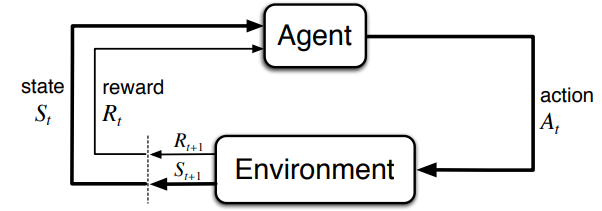

# 強化學習筆記

作者: Chun-Cheng Lin
日期: 2025/07/21

---

## Markov Decision Process

### Agent與環境的互動

Agent是學習者以及決策者，環境給予agent狀態$S_t \in \mathcal{S}$後，agent做出對應動作$A_t \in \mathcal{A(s_t)}$，環境會給予評分$R_{t + 1}$與下一個狀態$S_{t + 1}$。
一個*trajectory*是agent與環境互動的序列如:

$$S_0, A_0, S_1, A_1, R_2, S_2, A_2, R_3, \dots$$

在MDP中我們假設具有Markov property，也就是

> 當前的狀態$S_t$和獎勵$R_t$的機率分布，僅依賴於前一個狀態$S_{t−1}$與採取的行動$A_{t−1}$，而與更早的歷史無關。

因此$S_t, R_t, S_{t - 1}, A_{t - 1}$具有以下的轉移機率:

$$ p(s^\prime, r \mid s, a) = \text{Pr}\{S_t = s^\prime, R_t = r | S_{t - 1} = s, A_{t - 1} = a\} \\
    p: \mathcal{S} \times \mathcal{R} \times \mathcal{S} \times \mathcal{A} \to [0, 1]
$$