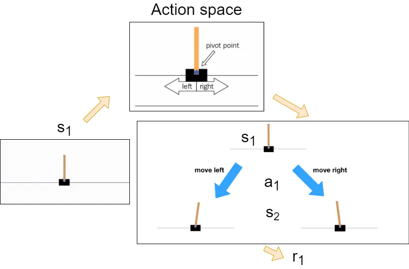
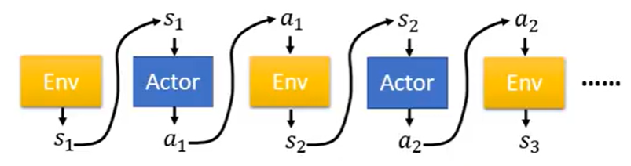
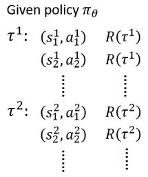
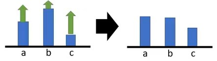
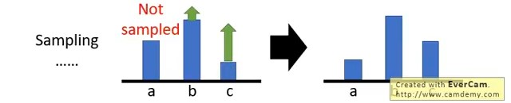
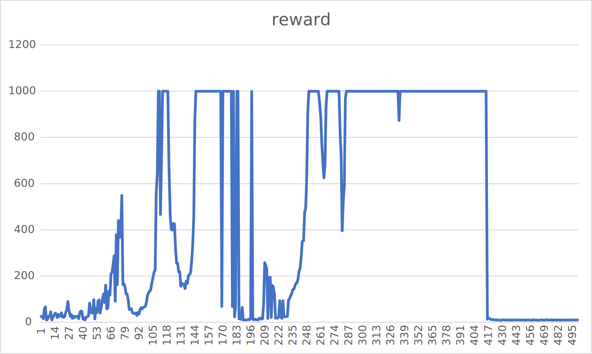
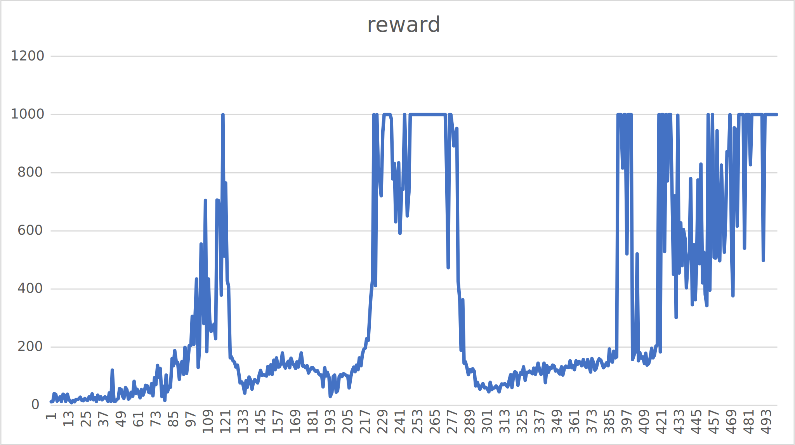
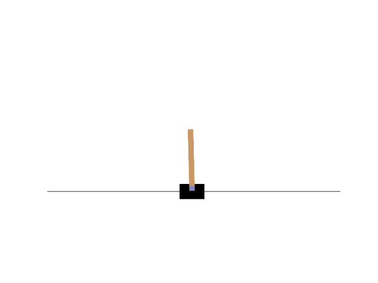
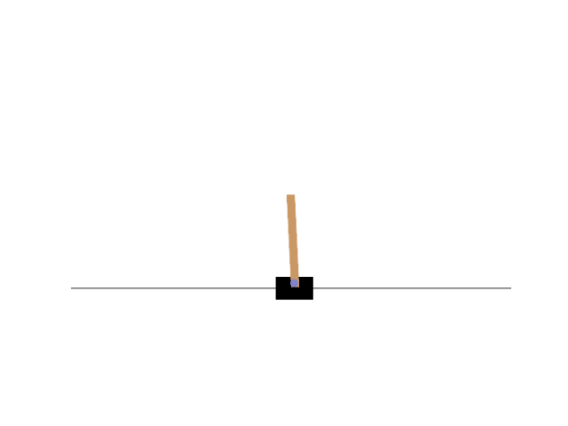

# RL Policy Gradient

## 複習RL

### 基礎components

+ Agent(Actor)
+ Environment
+ Reward function

### 基礎名詞

+ State
+ Reward
+ Policy

### Policy

Policy $\pi$ 可以解釋成Agent看到一個state後決策出下一個行為的決策策略，以數學表示即 $\pi(s) = a$ ，是一個mapping的函式($\pi: S \to A$)，Policy在機器學習領域中有table實作的，但在深度學習中更常用Neural network(後簡稱NN)取代table，好比數學上table與function的關係。
在此文中將Policy定義為一個NN且NN的參數為 $\theta$。

這裡給一個例子說明，最一開始遊戲的state是$s_1$，且Action space有左移一步與右移一步兩種，policy $\pi$ 就是在environment給出state $s_1$後要決策出應該做move left還是move right，也就是 $\pi(s_1) = a_1$ —決定採取action $a_1$，做完action $a_1$後environment會變成state $s_2$以及給出一個reward $r_1$，整個遊戲過程會是$s_1, a_1 \to s_2, r_1$，$s_2, a_2 \to s_3, r_2$，$s_3, a_3 \to s_4, r_3 \cdots$一路下去直到environment回傳done代表結束了(如agent在遊戲中死掉了，或agent破關了)，一次的遊戲過程稱為一個"episode"，整個episode的總reward為$R = \sum_{t = 1}^{T} r_t$。

### Trajectory



圖片取自 李宏毅老師教學影片
([https://youtu.be/z95ZYgPgXOY?si=m7MIkFosjZnr7thR&t=764](https://youtu.be/z95ZYgPgXOY?si=m7MIkFosjZnr7thR&t=764))
一個Episode的過程可以看做一連串的序列，稱作"Trajectory"，定義為:
$$\tau = \left\{s_1, a_1, s_2, a_2, \cdots, s_T, a_T \right\}$$一個trajectory出現的機率在數學上可以寫作
$$\begin{align*}
    p_\theta(\tau) &= p(s_1)p_\theta(a_1|s_1)p(s_2|s_1,a_1)p_\theta(a_2|s_2)p(s_3|s_2,a_2)\cdots \\
    &= p(s_1)\prod_{t = 1}^{T}p_\theta(a_t|s_t)p(s_{t+1}|s_t,a_t)
\end{align*}$$其中$p_\theta(a_t|s_t)$是給定NN的參數$\theta$在NN看到state $s_t$後輸出action $a_t$的機率，policy輸出的是一個distribution，如在上面立火柴遊戲的例子中決策動作時，其實有點像classification problem中最後輸出的是每一個分類的信心機率，policy輸出的是下一個動作的機率，如30%往左，70%往右，而$p(s_{t+1}|s_t,a_t)$依遊戲有所不同，需看遊戲在做出一個action $a_t$後下一個state $s_{t+1}$是固定的還是機率性的。
另外，一個trajectory的總reward寫作$R(\tau) = \sum_{t = 1}^{T}r_t$

### RL目標
$p(s_{t+1}|s_t,a_t)$是environment給定的，我們無法控制，能改變的只有$p_\theta$，目的是調整NN參數  $\theta$ 使$R(\tau)$越大越好，但是由上面trajectory的介紹可知$R(\tau)$其實是一個隨機的值，所以能夠計算的只有在給定參數 $\theta$ 的情況下$R(\tau)$的期望值，而這個期望值怎麼算，就是窮舉所有的trajectory，可以算出$$\bar{R}_\theta = \sum_{\tau}R(\tau)p_\theta(\tau) = E_{\tau \sim p_\theta(\tau)}[R(\tau)]$$其中$E_{\tau \sim p_\theta(\tau)}[R(\tau)]$的讀法是從$p_\theta(\tau)$這個distribution中sample出$\tau$然後計算$R(\tau)$的期望值，$\bar{R}_\theta$稱作"Expected Reward"，所以RL的目標是**最大化$\bar{R}_\theta$**。

## Policy Gradient

### 推導

最大化函式也就是最佳化問題，常用的就是gradient ascent，$\bar{R}_\theta = \sum_{\tau}R(\tau)p_\theta(\tau)$，要推導如何計算$\nabla \bar{R}_\theta$:
$$\begin{align}
    \nabla \bar{R}_\theta &= \sum_{\tau}R(\tau)\nabla p_\theta(\tau) \\
    &=\sum_{\tau}R(\tau)p_\theta(\tau)\frac{\nabla p_\theta(\tau)}{p_\theta(\tau)}\\
    &=\sum_{\tau}R(\tau)p_\theta(\tau)\nabla \ln(p_\theta(\tau))\\
    &=E_{\tau\sim p_\theta(\tau)}[R(\tau)\nabla\ln(p_\theta(\tau))]\\
    &\approx \frac{1}{N}\sum_{n = 1}^{N}R(\tau^n)\nabla\ln(p_\theta(\tau^n))\\
    &=\frac{1}{N}\sum_{n = 1}^{N}\sum_{t = 1}^{T_n}R(\tau^n)\nabla \ln(p_\theta(a_t^n|s_t^n))
\end{align}$$
+ $(1)$因為只有$p_\theta$與$\theta$有關，且$R(\tau)$不需要是可微分的。
+ $(1) \to (3)$有一個偏微分公式$\nabla f(x) = f(x) \nabla \ln(f(x))$，這是簡單的偏微分。
+ $(3)\to(4)$是因為可看成有$\sum_\tau R(\tau) p_\theta(\tau)$，一樣的$R(\tau)$是隨機的值，所以只能計算期望值$E_{\tau \sim p_\theta(\tau)}[R(\tau)]$，只是$\sum_\tau R(\tau) p_\theta(\tau)\nabla\ln p_\theta(\tau)$多乘上一個權重$\nabla\ln p_\theta(\tau)$，所以才會有$(3)\to(4)$的計算。
+ $(4)\to(5)$是因為期望值的計算實際上沒辦法窮舉所有的可能，所以改用sample一大堆的$\tau$的方式去逼近。
+ $(5)\to(6)$的過程是展開$p_\theta(\tau^n)$，它是可以計算的，$p_\theta(\tau) = p(s_1)\prod_{t = 1}^{T}p_\theta(a_t|s_t)p(s_{t+1}|s_t,a_t)$，但是$p(s_1)$與$p(s_{t+1}|s_t,a_t)$是environment給定的改變不了且與參數 $\theta$ 無關，因此$\nabla \ln p_\theta(\tau^n)$真正會計算的只有$\nabla\ln p_\theta(a_t^n|s_t^n)$。

這個公式可以直觀的理解，$(a_t^n, s_t^n)$是整個trajectory的某一個時間點，如果這個$(a_t^n, s_t^n)$可以使$R(\tau)$變大，那就要增加$(a_t^n, s_t^n)$出現的機率，反之則應減少。

### 應用

整理推導出的$\nabla \bar{R}_\theta = \frac{1}{N}\sum_{n = 1}^{N}\sum_{t = 1}^{T_n}R(\tau^n)\nabla\ln(p_\theta(a_t^n|s_t^n))$，利用到gradient ascent中做 $\theta \gets \theta + \eta \nabla\bar{R}_\theta$ 去調整 $\theta$，而在算$\nabla \bar{R}_\theta$之前需要先收集資料:

圖片取自 李宏毅老師教學影片
實作上是讓agent去與environment互動，得到trajectory $\tau^n$過程中的每個$(s_t^n,a_t^n,r_t^n)$在$\tau^n$結束後才能算出$R(\tau^n)$，收集過程中要計算每一個$(s_t^n,a_t^n)$pair的log probability，才能算出$\nabla\ln(p_\theta(a_t^n|s_t^n))$。
Policy gradient是on policy的訓練方式(只能從當前的policy $\pi$學習)，所以這些trajectory的資料在用完後就會丟掉了，只會用一次。

### 實作細節

上面有提到policy gradient很像是在處理classification problem，可以將遊戲的state當作物件辨識的object，NN回答應該做什麼action(如左移、右移)，這個回答的action就像是classification problem回答object是哪一個class，如果當作是classification problem解決的話，minimize cross entropy的過程會是$\frac{1}{N}\sum_{n = 1}^{N}\sum_{t = 1}^{T_n}\nabla\ln p_\theta(a_t^n|s_t^n)$，回到RL問題其實就只要記得在loss(也就是$\ln p_\theta(a_t^n|s_t^n)$)要記得乘上$R(\tau^n)$，變成$\frac{1}{N}\sum_{n = 1}^{N}\sum_{t = 1}^{T_n}R(\tau^n)\nabla\ln p_\theta(a_t^n|s_t^n)$。

### 實作tip

#### Add a baseline
> 用處: 解決遊戲的reward總是正的情況

$\nabla \bar{R}_\theta = \frac{1}{N}\sum_{n = 1}^{N}\sum_{t = 1}^{T_n}R(\tau^n)\nabla\ln(p_\theta(a_t^n|s_t^n))$的式子直覺上解釋是如果reward是正的那就要提升發生的機率，反之reward是負的就要減少發生機率，但若此時遊戲不可能有負的reward發生時如乒乓遊戲只有0 ~ 21分，假設現在只有2、3分，但套入公式我們還是會提升它發生的機率，想想可能覺得怪，但在理想中可能沒有問題，以下圖說明:

圖片取自 李宏毅老師教學影片
假設現在NN只有三種action，遊戲都是正reward，但每一種action得到的reward不一樣，所以即使大家都機率上升，但上升的程度不一樣，因此在經過處理(如normalize)後，因為NN輸出的是機率，每個action的機率相加要是1，所以上升少的就是機率會下降，上升多的機率會上升。

但是實作上不可能所有trajectory都探索一遍，我們用sample的方式去逼近，但sample就是機率性的行為，假設一樣NN只有3個action，遊戲只有正reward，action B、C都有sample到，但action A沒有，如此結果B、C的reward一定是正的，A沒有reward，經過處理後會發生由於A的reward是0，處理過後會下降，但action A可能不是不好的action，只是沒被sample到，這就會有問題了。
解決方法就是在公式中加一個baseline，變$\nabla \bar{R}_\theta = \frac{1}{N}\sum_{n = 1}^{N}\sum_{t = 1}^{T_n}(R(\tau^n) - b)\nabla\ln(p_\theta(a_t^n|s_t^n))$，減掉baseline可以使雖然遊戲的reward都是正的，只要該action的reward低於baseline，算起來就會是負的reward，機就會下降了，反之action reward大於baseline機率仍會上升。
baseline怎麼訂，就很自由了，可以自己設計，李宏毅提供一個可以用的baseline就是 $b \approx E[R(\tau)]$，也就是$R(\tau)$的平均值。

## 實驗-Policy Gradient用於OpenAI gym CartPole-v1

先定義Policy NN

```py
# Model.py
import torch

class Model(torch.nn.Module):
    def __init__(self, inDim, outDim):
        super().__init__()
        self.l1 = torch.nn.Linear(inDim, 32)
        self.relu1 = torch.nn.ReLU()
        self.l2 = torch.nn.Linear(32, 32)
        self.relu2 = torch.nn.ReLU()
        self.l3 = torch.nn.Linear(32, outDim)
        self.allActionProb = torch.nn.Softmax(dim = -1)
    def forward(self, x):
        out = self.l1(x)
        out = self.relu1(out)
        out = self.l2(out)
        out = self.relu2(out)
        out = self.l3(out)
        out = self.allActionProb(out)
        return out
```

很基礎的NN，只有三層Linear層，最後輸出的layer套入softmax中將輸出轉為機率
定義Agent

```py
# Agent.py
import Model
import torch
import numpy as np

class Agent:
    def __init__(self, device, stateDim, actionDim):
        self.lr = 0.01
        self.gamma = 0.99
        self.log_probs = []
        self.ep_rewards = []
        self.policy = Model.Model(stateDim, actionDim).to(device)
        self.optimizer = torch.optim.Adam(self.policy.parameters(), self.lr)
        self.device = device
    
    def selectAction(self, state):
        actionProb = self.policy(state)
        distri = torch.distributions.Categorical(actionProb)
        action = distri.sample()
        log_prob = distri.log_prob(action)
        self.log_probs.append(log_prob)
        return action.item()
    
    def getDiscountedAndStandardizedRewards(self):
        discountedRewards = [0] * len(self.ep_rewards)
        curr = 0
        for i in range(len(self.ep_rewards) - 1, -1, -1):
            curr = curr * self.gamma + self.ep_rewards[i]
            discountedRewards[i] = curr
        discountedRewards = torch.FloatTensor(discountedRewards)
        discountedRewards = (discountedRewards - discountedRewards.mean()) / (discountedRewards.std() + 1e-9)
        return discountedRewards
    
    def train(self, discountedAndStandardizedRewards: torch.Tensor):
        policyLoss = []
        for log_prob, R in zip(self.log_probs, discountedAndStandardizedRewards):
            policyLoss.append(-log_prob * R)
        policyLoss = torch.cat(policyLoss).sum().to(self.device)
        self.optimizer.zero_grad()
        policyLoss.backward()
        self.optimizer.step()
        return policyLoss.item()
    
    def save(self, path: str):
        torch.save(self.policy.state_dict, path)
```

細節討論:

```py
def selectAction(self, state):
    actionProb = self.policy(state)
    distri = torch.distributions.Categorical(actionProb)
    action = distri.sample()
    log_prob = distri.log_prob(action)
    self.log_probs.append(log_prob)
    return action.item()
```

在policy gradient中選擇下個動作的方式在訓練時不用$\epsilon$-greedy，但也不是直接使用最大機率的動作作為輸出，而是利用NN輸出每個動作的機率，利用這些機率去分布distribution，再從這個distribution中sample出一個動作作為下一個action，不利用最大機率可以提供訓練時的探索隨機性，其中probability取log是直接用torch的函式，算是特殊語法。

```py
def getDiscountedAndStandardizedRewards(self):
    discountedRewards = [0] * len(self.ep_rewards)
    curr = 0
    for i in range(len(self.ep_rewards) - 1, -1, -1):
        curr = curr * self.gamma + self.ep_rewards[i]
        discountedRewards[i] = curr
    discountedRewards = torch.FloatTensor(discountedRewards)
    discountedRewards = (discountedRewards - discountedRewards.mean()) / (discountedRewards.std() + 1e-9)
    return discountedRewards
```

這一步是在一次episode結束之後要計算該次episode每個時間點的reward，而隨著時間的推進，離現在越遠的reward的影響應該要降低，所以記得倒著迭代episode的reward，因為最新的reward在最後面，用$\gamma$做discount($\gamma$可設0.99或0.95之類接近1的數)，最後將discounted reward做標準化(Standardized)，標準化與歸一化對於gradient based的算法有加速以及穩定收斂的功效，但實際數學原理本人尚未明瞭，然而在一些實驗中有證明對reward標準化確實可以幫助收斂。

```py
def train(self, discountedAndStandardizedRewards: torch.Tensor):
    policyLoss = []
    for log_prob, R in zip(self.log_probs, discountedAndStandardizedRewards):
        policyLoss.append(-log_prob * R)
    policyLoss = torch.cat(policyLoss).sum().to(self.device)
    self.optimizer.zero_grad()
    policyLoss.backward()
    self.optimizer.step()
    return policyLoss.item()
```

**重點:** 這是實際對NN進行policy gradient調整的地方，**雖然上面的推導都是用gradient ascent**，然而由於framework以及習慣的原因，更常用的是gradient descent，所以要改變梯度的算法，原本的$R(\tau^n)\nabla\ln p_\theta(a_t^n|s_t^n)$改成對$-R(\tau^n)\nabla\ln p_\theta(a_t^n|s_t^n)$做梯度下降，相對來說就是對$R(\tau^n)\nabla\ln p_\theta(a_t^n|s_t^n)$做梯度上升，因此在程式中寫的是-log_prob * R

```py
for log_prob, R in zip(self.log_probs, discountedAndStandardizedRewards):
    policyLoss.append(-log_prob * R)
```

調整NN的部分交給PyTorch的backpropagation以及Adam。
定義Environment

```py
# Env.py
import gym
import Agent
import torch
import numpy as np
import csv

class Env:
    def __init__(self, device, gameName: str, renderMode = "human"):
        self.env = gym.make(gameName, render_mode = renderMode)
        self.history = {
            "reward": [],
            "loss": []
        }
        self.device = device
    
    def runOneEpisode(self, maxScoreLimit: float, agent: Agent.Agent):
        state = self.env.reset()[0]
        totalReward = 0
        done = False
        agent.ep_rewards.clear()
        agent.log_probs.clear()
        while (not done):
            # self.env.render()
            state = torch.FloatTensor(state).unsqueeze(0).to(self.device)
            action = agent.selectAction(state)
            state_next, reward, done, truncated, info = self.env.step(action)
            totalReward += reward
            agent.ep_rewards.append(reward)
            
            if (done):
                break
            if (totalReward >= maxScoreLimit):
                break
            state = state_next
        discountedAndStandardizedRewards = agent.getDiscountedAndStandardizedRewards()
        loss = agent.train(discountedAndStandardizedRewards)
        self.history["reward"].append(totalReward)
        self.history["loss"].append(loss)
        return loss, totalReward
        
    def train(self, iterNum, maxScoreLimit: float, agent: Agent.Agent):
        for episode in range(1, iterNum + 1, 1):
            loss, reward = self.runOneEpisode(maxScoreLimit, agent)
            print("|Episode: %4d|Loss: %5.6f|Reward: %5.6f" % (episode, loss, reward))
        self.env.close()
    
    def log(self, path: str):
        with open(path + "/loss.csv", "w", newline = "") as csvfile:
            writer = csv.writer(csvfile)
            for loss in self.history["loss"]:
                writer.writerow([loss])
        with open(path + "/reward.csv", "w", newline = "") as csvfile:
            writer = csv.writer(csvfile)
            for loss in self.history["reward"]:
                writer.writerow([loss])
    
    @property
    def actionDim(self):
        return self.env.action_space.n
    @property
    def stateDim(self):
        return self.env.observation_space.shape[0]
```

Env就比較沒有什麼重點，主要是打包OpenAI gym成Env類，並寫run一個episode的循環邏輯。
寫主要執行的python entrypoint

```py
# demo.py
import torch
import Env
import Agent
import matplotlib.pyplot as plt

if __name__ == "__main__":
    device = torch.device("cuda:0" if torch.cuda.is_available() else "cpu")
    env = Env.Env(device, "CartPole-v1", "rgb_array")
    agent = Agent.Agent(device, env.stateDim, env.actionDim)
    env.train(500, 1000, agent)
    agent.save("./policyGradientModel.pth")
    env.log("./history")
    plt.plot(list(range(1, len(env.history["reward"]) + 1)), env.history["reward"])
    plt.show()
```

### 實驗結果

lr = 0.01

lr = 0.005


實驗結果可以發現到其實有學習，也能夠達到很多次1000分(設定最高分的上限)，但是可以觀察到即使很早就已經達到1000分，卻在後面訓練時可能發生分數暴跌的情況，到此我有幾個想法:
1. 網路上說純policy gradient收斂性不好，可能指的就像是實驗結果這樣，也就是policy gradient本身的缺點，甚至是所謂的catastrophic forgetting。
2. 由於在訓練過程中的selectAction是用distribution再sample的方式選動作，這代表選動作時具有隨機性，加上cartpole遊戲中只有兩個動作，且移動步長也不是連續實數，使得distribution再sample可能抽到錯的action。

### 驗證實驗結果

先實驗訓練出來的NN是不是垃圾:
lr = 0.005，取最大機率動作

lr = 0.005，取機率分布sample動作

lr = 0.01，收斂不好

由上方實驗的結果可以發現到lr = 0.01且最後分數暴跌的NN真的看不出訓練的效果 ~~(就是垃圾)~~ 。
對於最後仍達到1000分且lr = 0.005 NN，在驗證時可以發現確實NN有訓練好而且穩健，因此我嘗試了兩種不同的selectAction方式，也就是只取最大機率的action與機率分布sample action兩種，發現其實兩種方式都可以穩定的到1000分，唯一比較不同的是distribution sample的方式似乎比較
常有移動的現象，反觀取最大機率的方法更穩健些，基本不太移動。
而這實驗或許可說明實驗結果的假設二是錯的，因為兩種方法NN都有辦法將火柴穩住，且用機率分布的方式可以增加探索的動力，有助於訓練。
經過許多次實驗還是會發生與上方折線圖一樣在高分後突然跌到谷底的現象，現在我認為可能是lr的調整問題或是真的會發生catastrophic forgetting。

原始碼: [Github](https://github.com/jimlin2004/LearnAI/tree/main/RL/PolicyGradient)